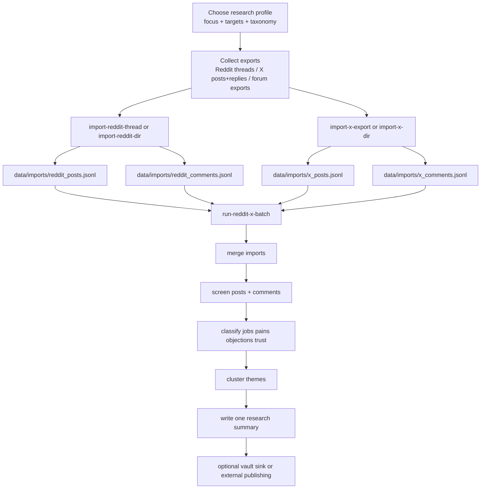

# Pipeline Flow

## Notes

- The import step is where scale happens. With enough export files, the same batch path can handle 1k to 10k+ items.
- The batch path intentionally writes one main report: `reports/staging/research-summary.md`.
- Profile reuse comes from swapping focus, target, and taxonomy config files.
